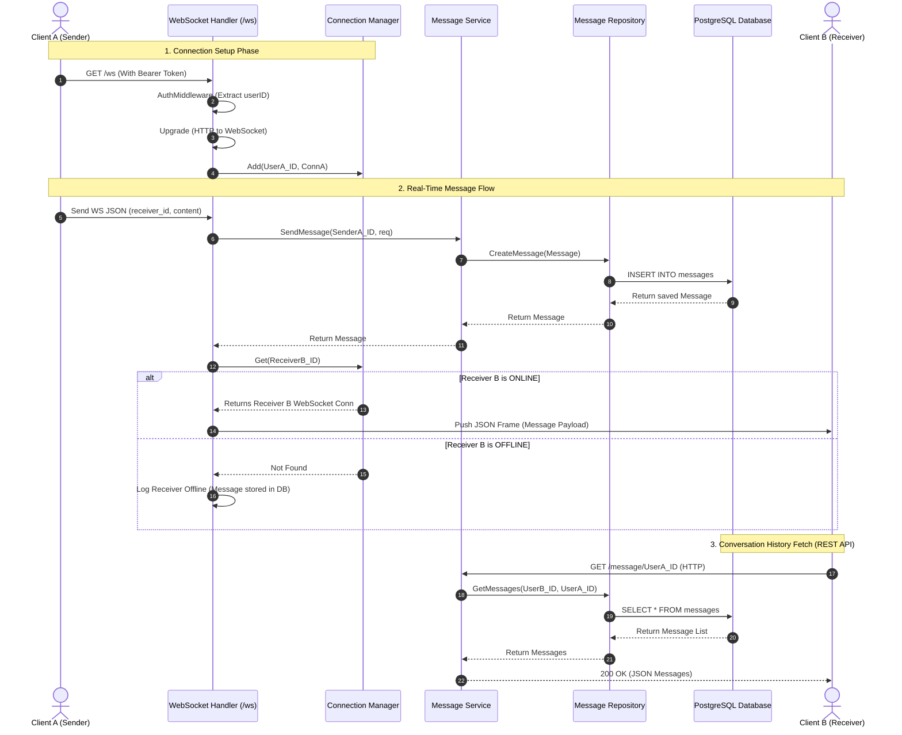

# System Architecture & Message Flow

This document details the communication flow of the Chat Application backend, illustrating how **WebSocket (Real-Time)** and **HTTP REST (State/History)** work together.

---

## 1. Role of `MessageHandler` & REST Endpoints

### Is `MessageHandler` still needed?
**Yes, absolutely!** `MessageHandler` is essential for the following reasons:

1. **`WebSocket` is a method on `MessageHandler`**:
   - `WebSocket(c *gin.Context)` in `handlers/websocket_handler.go` is actually a handler method of `MessageHandler`. It provides access to `MessageService` (for saving messages to DB) and `ws.ConnectionManager` (for managing active sockets).

2. **Fetching Conversation History (`GET /message/:otherUserID`)**:
   - WebSockets are used for transmitting **live/new** events while connected.
   - When a user logs in, reopens the app, or opens a conversation tab, the app makes an HTTP REST request to `GET /message/:otherUserID` to fetch historical chat records from the database.

3. **HTTP REST Messaging Fallback (`POST /message`)**:
   - Serves as a REST fallback for sending messages if WebSocket connection drops or for external integrations/bots.

---

## 2. Text Visual Flow Diagram

```text
==========================================================================================
                                  REAL-TIME WEBSOCKET FLOW
==========================================================================================

 [ Client A (Sender) ]                             [ Client B (Receiver) ]
          │                                                   ▲
          │  1. Connect: GET /ws (Header: Bearer JWT)         │
          ├─────────────────────────────────────────┐         │
          │                                         ▼         │
          │                              ┌────────────────────┴┐
          │                              │ ConnectionManager   │
          │                              │ (maps UserID -> WS) │
          │                              └────────────────────┬┘
          │  2. Send WS Frame                       ▲         │
          │     {"receiver_id": "...", content}     │         │
          ▼                                         │ 5. Get  │ 6. Push Live Message
┌───────────────────────────────────┐               │    Conn │    (if Online)
│ WebSocket Handler                 │───────────────┘         │
│ (handlers/websocket_handler.go)   │                         │
└─────────────────┬─────────────────┘                         │
                  │ 3. Save Message                           │
                  ▼                                           │
┌───────────────────────────────────┐                         │
│ MessageService                    │                         │
│ (services/message_service.go)     │                         │
└─────────────────┬─────────────────┘                         │
                  │ 4. Insert Record                          │
                  ▼                                           │
┌───────────────────────────────────┐                         │
│ MessageRepository & PostgreSQL DB │                         │
└───────────────────────────────────┘                         │

==========================================================================================
                                CONVERSATION HISTORY (REST API)
==========================================================================================

 [ Client (A or B) ]
          │
          │ 1. GET /message/:otherUserID (HTTP REST Request)
          ▼
┌───────────────────────────────────┐
│ MessageHandler.GetConversation    │
│ (handlers/message_handler.go)     │
└─────────────────┬─────────────────┘
                  │ 2. GetConversation(userID, otherUserID)
                  ▼
┌───────────────────────────────────┐
│ MessageService                    │
└─────────────────┬─────────────────┘
                  │ 3. GetMessages(...)
                  ▼
┌───────────────────────────────────┐
│ MessageRepository & PostgreSQL DB │
│ SELECT * FROM messages ...        │
└─────────────────┬─────────────────┘
                  │
                  │ 4. Return JSON array of past messages
                  ▼
          [ Response 200 OK ]
```

---

## 3. Sequence Diagram (Mermaid)



---

## 4. Data Flow Steps Breakdown

### Phase 1: Real-Time WebSockets (`/ws`)
1. **Handshake & Upgrade**:
   - Client sends HTTP upgrade request to `GET /ws` with JWT in Header.
   - `AuthMiddleware` verifies JWT and attaches `userID` to context.
   - Handshake upgrades request to a persistent WebSocket connection.
   - Connection saved in `ConnectionManager` map indexed by `userID`.

2. **Processing Incoming Message**:
   - `WebSocket` handler reads incoming JSON payloads in a loop.
   - Message is passed to `MessageService.SendMessage()`.
   - `MessageRepository` persists the message to PostgreSQL.

3. **Real-time Delivery**:
   - Handler queries `ConnectionManager.Get(ReceiverID)`:
     - **If Online**: Delivers message immediately over Receiver's open WebSocket connection.
     - **If Offline**: Execution continues; message remains stored safely in PostgreSQL.

---

### Phase 2: Historical Messages via REST (`/message/:otherUserID`)
1. Client sends HTTP request `GET /message/:otherUserID`.
2. `MessageHandler.GetConversation` reads logged-in `userID` and target `otherUserID`.
3. `MessageService.GetConversation` calls `MessageRepository.GetMessages`.
4. DB executes SQL query retrieving all past messages exchanged between the two users sorted by timestamp.
5. JSON response returned to Client to render history on screen.

---

## 5. Component Responsibility Summary

| Component | Responsibility |
| :--- | :--- |
| **`routes/routes.go`** | Registers endpoints (`/register`, `/login`, `/users`, `/message`, `/ws`). |
| **`middleware/auth.go`** | Validates JWT tokens and injects `userID` into request context. |
| **`handlers/websocket_handler.go`** | Manages WS upgrade, message reading loop, persistence, and live routing. |
| **`handlers/message_handler.go`** | Handles REST HTTP requests (fetching conversation history & REST fallback). |
| **`ws/manager.go`** | In-memory concurrent-safe registry (`RWMutex`) mapping `userID` -> `websocket.Conn`. |
| **`services/message_service.go`** | Business logic layer for creating and querying messages. |
| **`repositories/message_repository.go`** | Database interaction layer executing SQL queries. |
